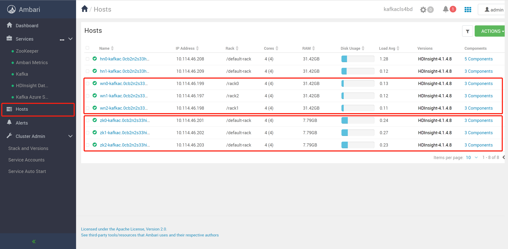
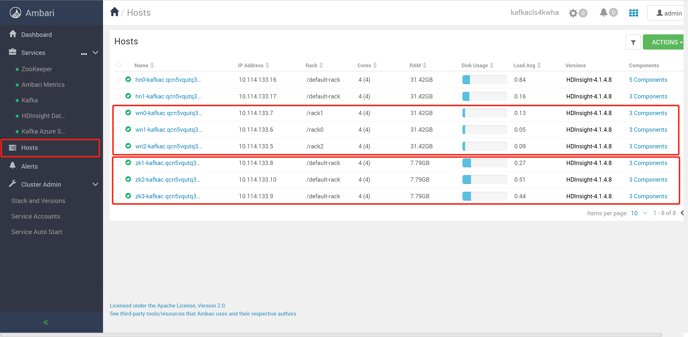
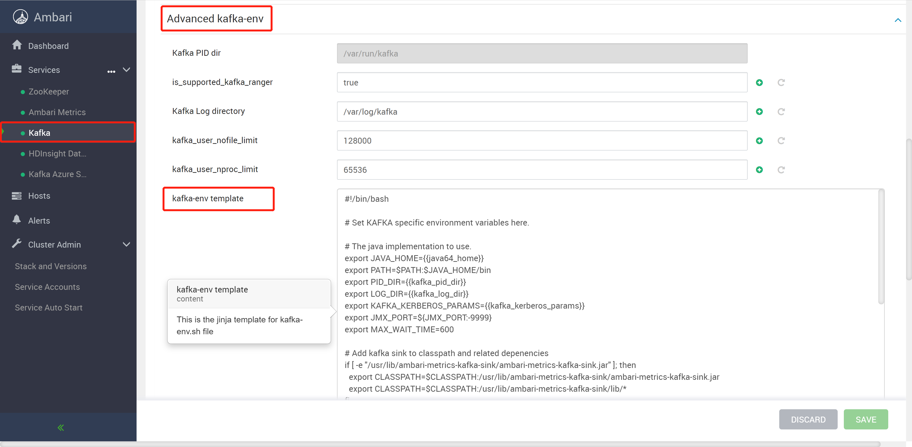
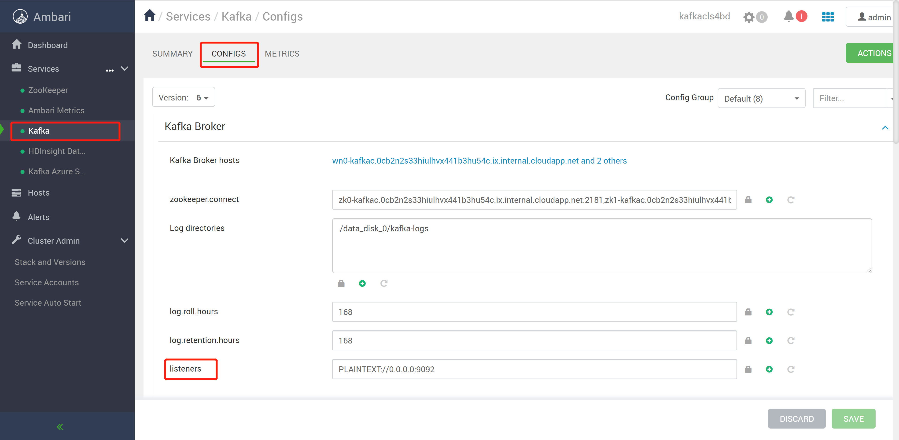
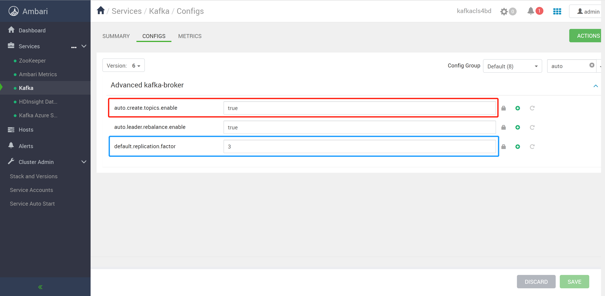
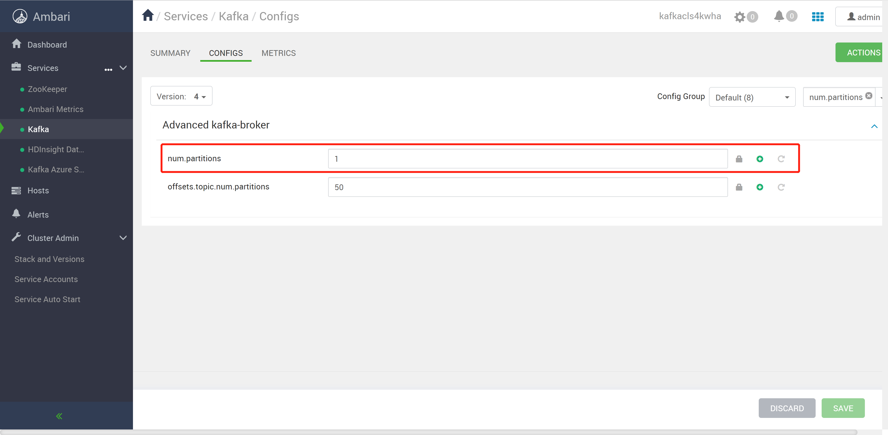

1. Two kafka clusters deployed at two VNET
2. Peering the both VNETs
3. Kafka Clusters Information
   * ***Target*** Kafka Cluster (***SECONDARY CLUSTER***)
     
   * ***Source*** Kafka Cluster (***PRIMARY CLUSTER***)
     

4. IP advertising configuration （***Both Cluster***）
   
   Add scripts:
   ```bash
    # Configure Kafka to advertise IP addresses instead of FQDN
    IP_ADDRESS=$(hostname -i)
    echo advertised.listeners=$IP_ADDRESS
    sed -i.bak -e '/advertised/{/advertised@/!d;}' /usr/hdp/current/kafka-broker/conf/server.properties
    echo "advertised.listeners=PLAINTEXT://$IP_ADDRESS:9092" >> /usr/hdp/current/kafka-broker/conf/server.properties
   ```
   > **Tips**: **MUST** Restart **ALL** of kafka components
5. Listener configuration （***Both Cluster***）
   
   ```bash
    # Change
    PLAINTEXT://localhost:9092
    # To
    PLAINTEXT://0.0.0.0:9092
   ```
   > **Tips**: **MUST** Restart **ALL** of kafka components
6. Create environment variable (***Recommend***)
   ```bash
    export PRIMARY_ZKHOSTS='10.114.133.8:2181,10.114.133.10:2181,10.114.133.9:2181'
    export PRIMARY_BROKERHOSTS='10.114.133.7:9092,10.114.133.6:9092,10.114.133.5:9092'
    
    export SECONDARY_ZKHOSTS='10.114.46.201:2181,10.114.46.202:2181,10.114.46.203:2181'
    export SECONDARY_BROKERHOSTS='10.114.46.199:9092,10.114.46.197:9092,10.114.46.198:9092'

    export TOPIC_NAME='YourWant'
   ```
7. Check ***BOTH*** of zookeeper services status (***Recommend***)
   ```bash
    /usr/hdp/current/kafka-broker/bin/kafka-topics.sh --list --zookeeper $PRIMARY_ZKHOSTS
    /usr/hdp/current/kafka-broker/bin/kafka-topics.sh --list --zookeeper $SECONDARY_ZKHOSTS

    /usr/hdp/current/kafka-broker/bin/zookeeper-shell.sh $PRIMARY_ZKHOSTS
    ls /brokers/ids

    /usr/hdp/current/kafka-broker/bin/zookeeper-shell.sh $SECONDARY_ZKHOSTS
    ls /brokers/ids
   ```
8. Create files: ***consumer.properties*** and ***producer.properties***
   ```bash
   vi consumer.properties
        # Source Kafka Cluster
        bootstrap.servers=10.114.133.8:2181,10.114.133.10:2181,10.114.133.9:2181
        group.id=mirrorgroup

   vi producer.properties
        # Target Kafka Cluster
        bootstrap.servers=10.114.46.199:9092,10.114.46.197:9092,10.114.46.198:9092
        compression.type=none
   ```
9.  Create a topic
    > **Tips1**: If want let maker mirroring to **auto create** at ***target cluster***, need set target cluster kafka config file first.

    > **Tips2**: HDInsight default.replication.factor is **4**, If your ***target cluster*** worker nodes count less than 4(MIN 3), need change this value to **less 4** or **manual create** the new topic/s

    > **Tips3**: HDInsight num.partitions default value is **1**, **NEED** change this value or  set the ***target's*** --partitions to more **than bigger** by **business requirements**

    
    

    > **Tips**: **MUST** Restart **ALL** of kafka components, After modified config's values.

    ```bash
    /usr/hdp/current/kafka-broker/bin/kafka-topics.sh --create --replication-factor 2 --partitions 3 --topic $TOPIC_NAME --zookeeper $PRIMARY_ZKHOSTS
    ```
10. Check the source cluster's topic status (***Recommend***)
    ```bash
    /usr/hdp/current/kafka-broker/bin/kafka-topics.sh --describe --zookeeper $PRIMARY_ZKHOSTS --topic $TOPIC_NAME
    ```
11. Startup topic mirroring
    ```bash
    /usr/hdp/current/kafka-broker/bin/kafka-run-class.sh kafka.tools.MirrorMaker --consumer.config consumer.properties --producer.config producer.properties --whitelist $TOPIC_NAME --num.streams 4
    ```
12. Check the target cluster's topic status (***Recommend***)
    ```bash
    /usr/hdp/current/kafka-broker/bin/kafka-topics.sh --describe --zookeeper $SECONDARY_ZKHOSTS --topic $TOPIC_NAME
    ```
13. Test write data to the source cluster
    ```bash
    /usr/hdp/current/kafka-broker/bin/kafka-console-producer.sh --broker-list $PRIMARY_BROKERHOSTS --topic $TOPIC_NAME
    ```
14. Test receive data from the target cluster
    ```bash
    /usr/hdp/current/kafka-broker/bin/kafka-console-consumer.sh --bootstrap-server $SECONDARY_BROKERHOSTS --topic $TOPIC_NAME --from-beginning
    ```
15. Delete topics (***If applicable***)
    ```bash
    /usr/hdp/current/kafka-broker/bin/kafka-topics.sh --zookeeper $PRIMARY_ZKHOSTS --delete --topic $TOPIC_NAME
    /usr/hdp/current/kafka-broker/bin/kafka-topics.sh --zookeeper $SECONDARY_ZKHOSTS --delete --topic $TOPIC_NAME
    ```